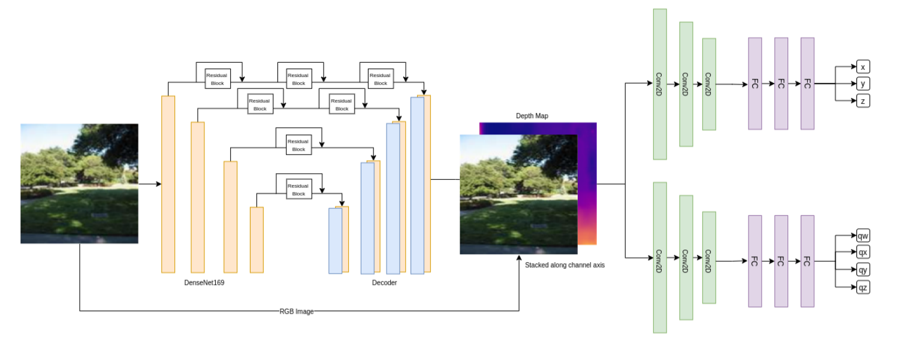
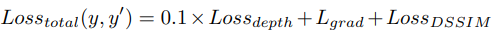
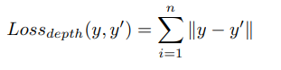
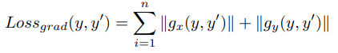
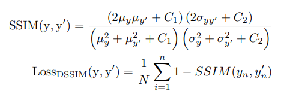
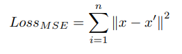
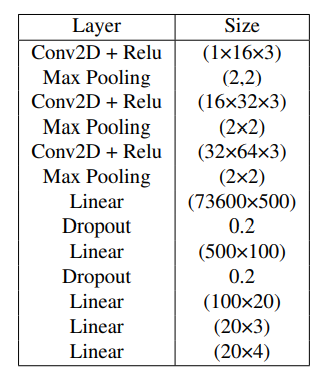
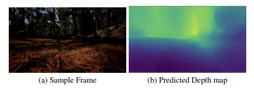
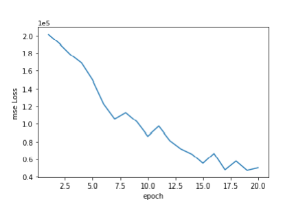
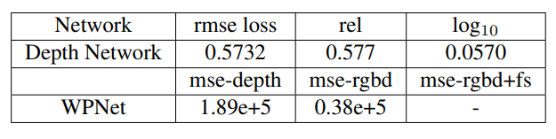

# Towards Online Waypoint Generation for a Quadrotor Using Enhanced Monocular Depth Estimation.

## Overview

Exploring and navigating autonomously in uneven and unstructured environments is an unsolved problem because flights have a high risk of collision and have a battery bottleneck due to limited storage onboard. Also due to environmental uncertainites, an intelligent autonomous aerial system is essential to navigate these environments. 

Current literature on autonomous flights focuses on mapping the environment first then navigating them. Our approach doesn’t assume that the environment is mapped, we take in real time images and try to navigate the environment. Also having a dense depth map of the real-world can be very useful in applications including navigation and scene understanding, augmented reality. Based on our experimental analysis of existing architectures and training strategies we set out with the design goal to develop a simpler architecture that makes training and future modifications easier. 

Our architecture is a modification of the DenseDepth to compute depth and this feeds into a novel parallized 2-way waypoint prediction network. We rely on transfer learning of the Encoder-Decoder weights for the depth network and train the WPNet from Ground zero. A novel thing about this architecture is that we can train each module seperately and it does not affect the performance of the network. This modular approach is advantageous if in future we want to substitute any network or improve the performance of any submodule. 

Our approach uses Depth Estimation with Multi-Task Regression-based Learning to individually learn the position of waypoints in X, Y, Z coordinates within the scene in addition to learning the qw, qz, qy, qz quaternions. The flight controller can change position and speed in real time to perform obstacle avoidance. Also it uses the inertial and visual information to predict waypoints so its a very robust approach in GPS-denied environments. For more information refer [this link](https://github.com/savnani5/WPNet/blob/main/Depth_WPNet.pptx).

---
## Approach

### Architecture

### Depth Network

● This model works on a encoder decoder based architecture and focuses more on design choices which leads to high quality depth maps. 

● The encoder of the network is DenseNet-169 pre-trained on ImageNet. 

● The output of the encoder is then fed into a series of bilinear upsampling layers. These upsampling layers and the corresponding skipconnections forms the decoder. 

● The decoder is hence composed of basic blocks of convolutional layers applied on the concatenation of the bilinear upsampling of the previous block with the skip connection data of the same spatial size after upsampling.

● We use the following loss for Depth Estimation:

### Waypoint Prediction Network

● For the input of the network we concatenate RGB images with the depth map at the channel dimension. 

● We parallize this network into two separate Convolutional feature extractors followed by linear layers to regress the waypoints. 

● We tried using a single network for WPNet but due to different scaling of the cartesian and quaternion waypoints the gradient was not backpropogating properly to the input, therefore we developed two parallel architectures.

● We use the following loss for Waypoint Prediction:

● The network Parameters are:

---
## Download the Dataset

1) [NYU_Depth_v2 dataset for Depth Estimation](https://s3-eu-west-1.amazonaws.com/densedepth/nyu_test.zip)
2) [Custom Regression Dataset for Waypoint Prediction](https://drive.google.com/drive/folders/16ZIi2aNkl4y1HaZcLaSx453Y9vk-LaTC?usp=sharing) 

---
## Results

Both networks were trained independently and the results were combined later.

● We trained the network for 287,500 iterations with a batch size of 4 on a NVIDIA V100 with 16G of memory on a 50K subset of the NYUv2 dataset provided by the authors of Densedepth. The optimizer used was Adam with a learning rate of 0.0001 with a exponential weight decay factor of 0.1 per epoch.

● We trained this network on Custom Regression dataset of 45k samples for 30 epochs with a mini-batch size of 16 and trained it on NVIDIA RTX 2060 with 6GB of Memory. Batchsize constraint is due to the NVIDIA graphics card. We used Adam optimizer with a learning rate of 0.001 and weight decay of 1e-6.

● Summary of Losses:

---
## Future Work

For more recent future work we would like to code another evaluation metric for the network output like the collision free distance moved additionally controlling the outputs with a traditional controller like LQR and simulating the results in airsim. We can code this based on the depth information and the check if the predicted waypoint is colliding with the nearby obstacle or not. Also we would like to change the Encoder-Decoder part of the Densedepth to a more parameter efficient network like MobileNet without compromising the performance. Furthermore for a longer timeline we are planning to make this network totally endto-end where it will also learn the control policies after the waypoint trajectory prediction, although generating such a custom dataset for this approach might be a big problem.
